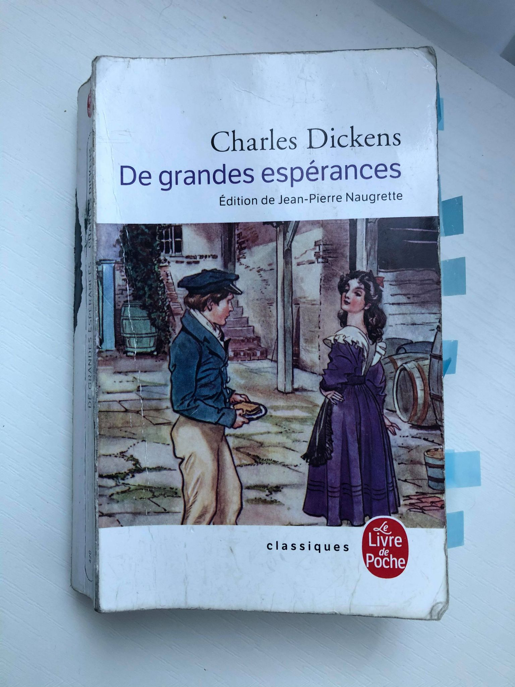

	Je apprendre la langue française. Ou, mieux sait, j'adore la langue française même si je suis à la debout de mon adventure.

                J'aime les défis aussi et car j'ai ete trop excite, j'ai achat Des grandes esperances en française
                et Madame Bovary en anglais. C'est en effet plutôt stupid mais, mise à part cet aspect, il faut que je
                lise un livre excellent et a même temps practice et augmente ma connaissance de la langue.

                Je participe à beaucoup d'aventures et ennuis avec Pip, un jeune enfant qui rêver du devenir un
                gentleman et qui partit à Londres pour frapper son but après avoir reçu une donation anonyme pour ses
                étudies.
                Dans l'action de la livre on decouvert beaucoup de parallèles sociales entre la vie de la petite ville
                à cote d'un marrais et la capitale de l'Angleterre.
                J'ai trouvé les conflits intérieurs du Pip plutôt racontable, aussi que son insuccès avec Estella, son
                obsession depuis l'adolescente.
                Pip est un personnage qui n'est pas capable de s'adapter dans la haute société et, cependant, il
                accomplit son rêve, avec beaucoup de sacrifices et sans oublier son origin.

                Mon seul regret est que je finis ce livre fort lentement et parce que je ne maîtrisent pas la langue,
                j'ai perdu dizaines de subtilités comme un demi-analphabete.
                Mais toutefois, ce livre a été une expérience magnifique et alors j'ai ajoute un autre titre sour la
                liste de bonnes lectures du 2021 😅.

		
