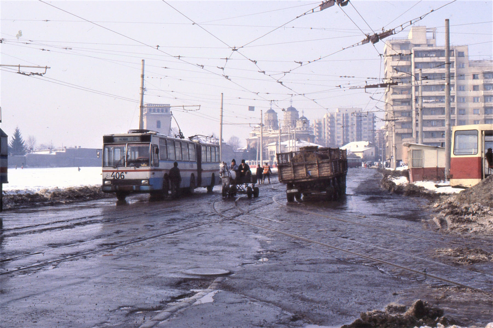

Am descoperit zilele astea această poză superbă din Iași, făcută undeva în jurul anilor '80:

<!--more-->
 Din păcate, nu am și o poză recentă cu zona deci nu pot face o comparație. Însă, poți observa diferențele pe viu cu o simplă plimbare până la tribunal!:)) Sunt foarte curios dacă fațada blocurilor arată la fel și astăzi. Chiar nu m-ar mira.

Tot fără motiv o atașez la postare și pe Leda lui Da Vinci.

Nefiind un connaisseur în domeniul artelor am crezut inițial că Leda este doar o fată pe care Da Vinci a ales să o deseneze:)) Am aflat însă că povestea e puțin diferită. Aparent Leda este un personaj mitologic. Iar Da Vinci nu a fost nici primiul și nici ultimul care a portretizat acest mit (găsești mai multe detalii [aici](https://en.wikipedia.org/wiki/Leda_and_the_Swan)). Din păcate însă, textul legendei nu se găsește pe Internet așa că am fost nevoit să mă mulțumesc cu articolul de pe Wikipedia.

În fine, am reușit să mă decid și în legătura cu melodia zilei, enjoy :)

 ✨[Tayc - C O M B L E U S E D E R E V E S](https://www.youtube.com/watch?v=CF31aACQjzs) ✨

Arrivederci!
