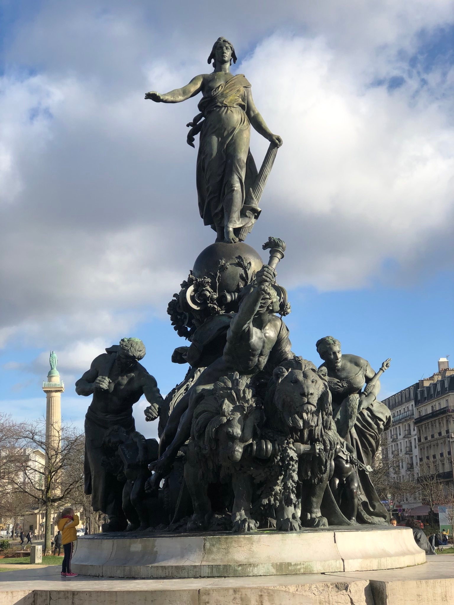
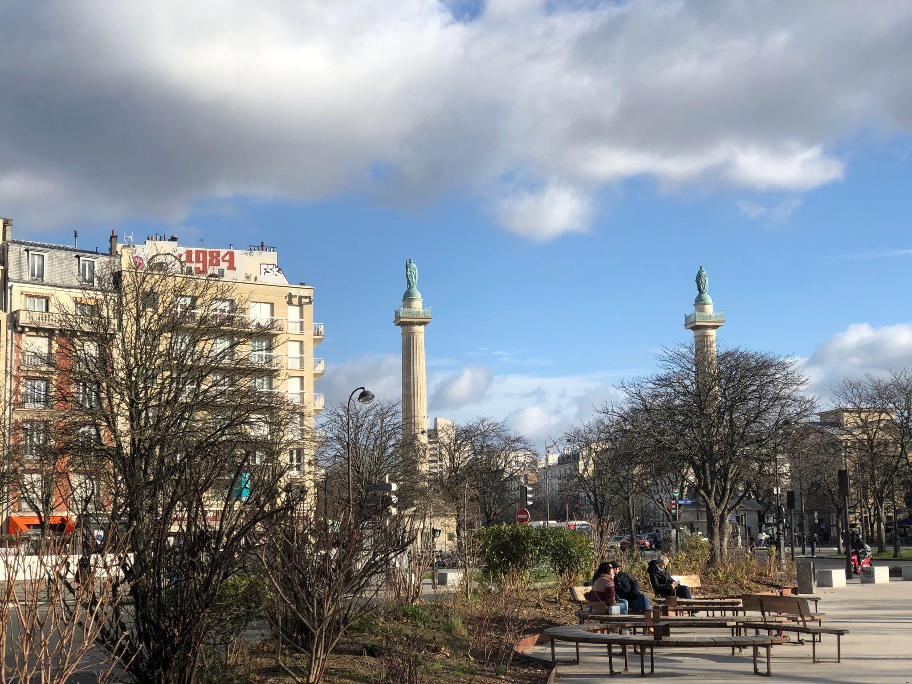
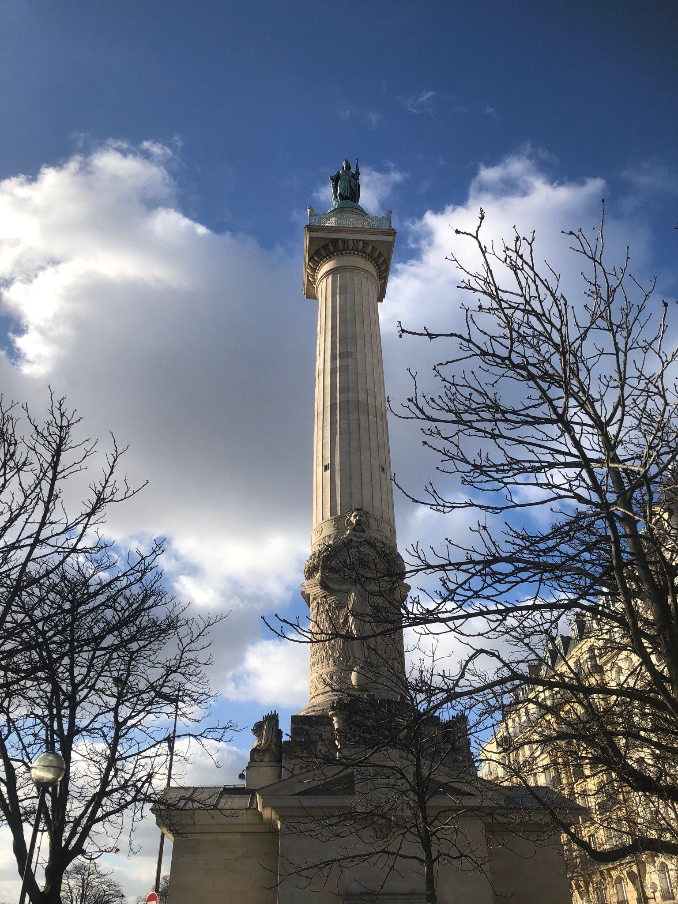

Ciao! Oggi abbiamo fatto un brunch a Parigi :)))
<!--more-->

Oggi abbiamo fatto = un fel de "am avut". Și restul e chiar intuitiv :) În ce a constat? O ciocolată caldă (în cazul meu), o cafea și un croissant pentru cei care au ales să-și ia "mâncare". Sau în loc de croissant, o felie de pâine, un pachețel de unt și 30g de dulceață (cochetă dar ieftină în super market). Pe mine m-a ajuns !!!5.4!!! !!!EURO!!!. Pe ceilalți nu i-am întrebat. Dar bănuesc că e horror. Să fereasca Dumnezeu!!!:)))

Astăzi mi-am readus aminte că treburile astea se află in orașul meu:

 Place du Trône-Renversé 🤭

 De la acest peisaj mi-a venit ideea articolului de azi!:)

 École de métiers tropp "«cher» niveau" à Paris :))

 Close-up pe stâlpii ăștia deosebiți :))

Melodia de azi: ✨[Brenda K Starr - Rabia](https://www.youtube.com/watch?v=HVcNCmHHsb4)✨

.Mi-am propus să încep să traduc melodiile astea în spaniolă. Am așa impresia că o să fie pline de ... surprize :)))

În fine, atât pe azi, arrivederci!
