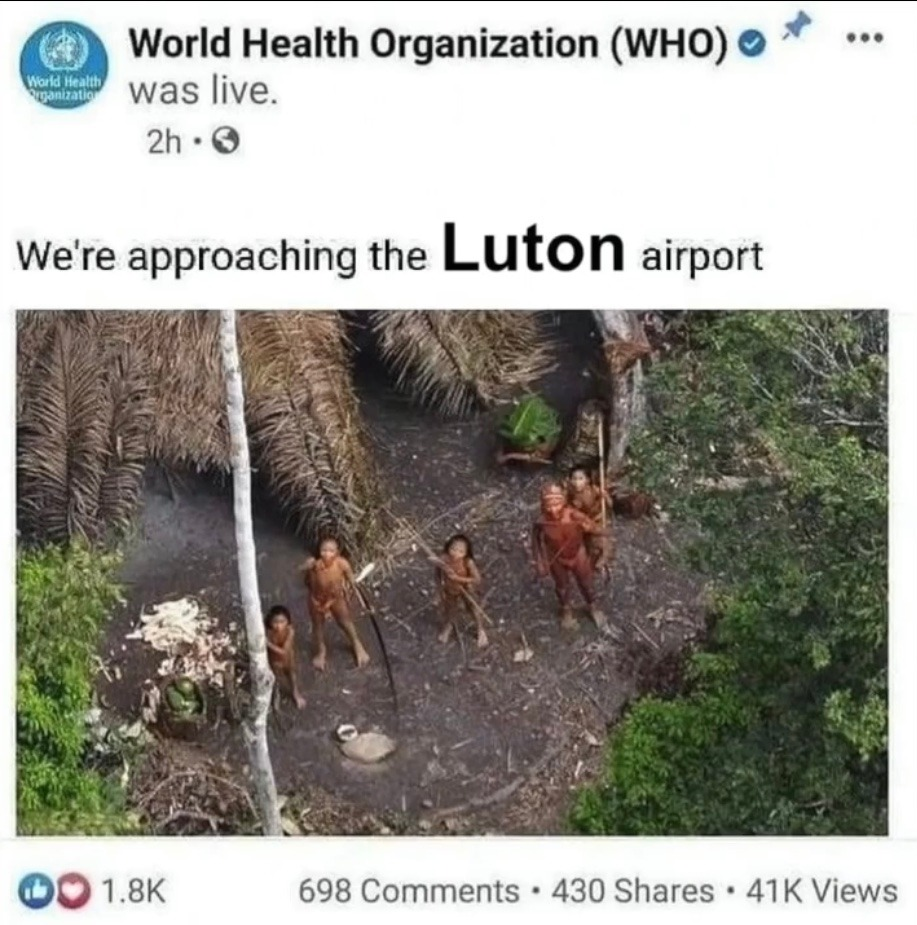
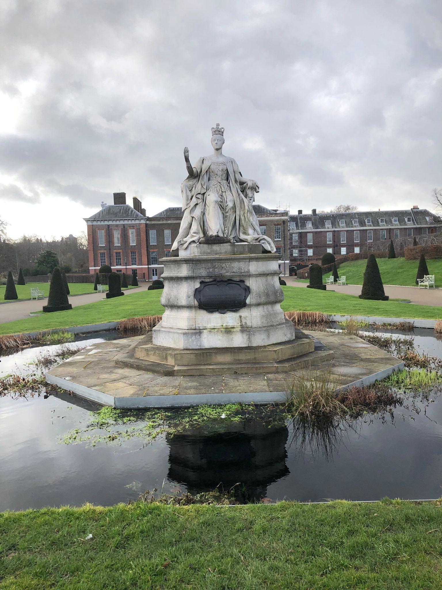
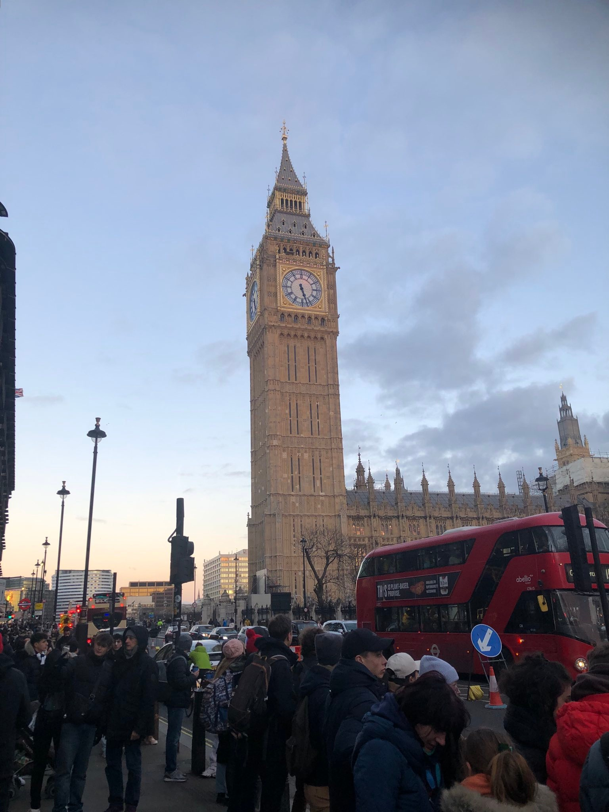
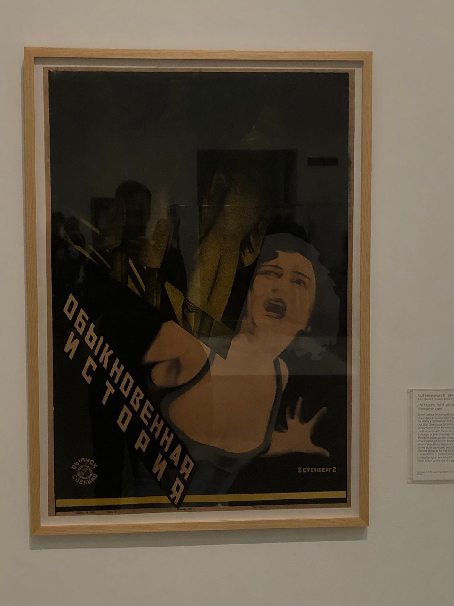
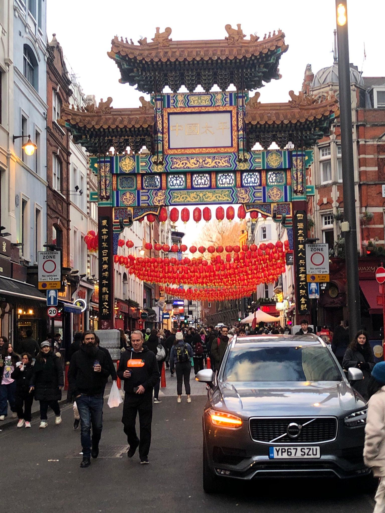
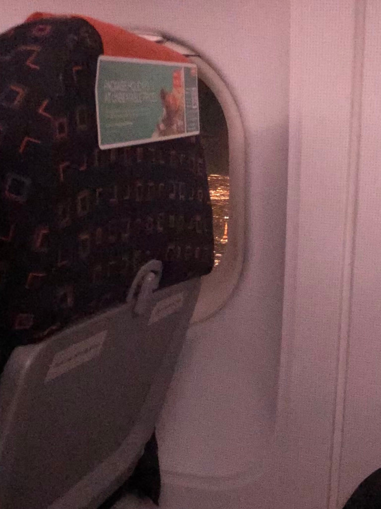

Weekend-ul trecut am avut plăcerea să vizitez Londra. Drept urmare, postarea asta va conține exagerat de multe poze.
<!--more-->
Chiar făceam așa, în capul meu, o comparație între ce vizitam acum un an și ceva(Vaslui :))) ), și ce am ocazia să văd acum. Ce pot să spun... Orice destinație are farmecul ei ;;)

Pentru că o poză face cât 1000 de cuvinte, voi atașa câteva dintre locurile/lucrurile care mi-au atras atenția :)

În primul rand:

Urmează și chestii care mi-au plăcut neironic:))

Statuie din Kensignton Park, vis a vis de Palatul Kensington

Exponat din Victoria&Albert Museum ("relatable" cât încă mă mai aflu într-un oraș cu metrou 😮")

Muzeul de Istorie Naturala(ADOR această clădire)

Și aceste coloane, care țin de același muzeu

Trafalgar Place, République de Londra ;P

Big Ben pentru că... bineînțeles (am fost extraordinar de dezamăgit să văd că acest obiectiv nu este luminat noaptea...)

Un view relativ frumos (stâlpul strică toată panorama...)

Mi-am adus aminte în această excursie că sunt îndrăgostit de obiectele de propagandă sovietică. Prin urmare nu pot să nu postez și următoarele 2 chestii :))

"Munca liberă te binecuvântează"

"O poveste obișnuită"

Trebuie să recunosc, cartierul chinezesc din Londra dă clasă celui din Parigi. 

Poarta de la intrarea cartierului chinezesc

Per total Londra mi s-a parut meh. Probabil din cauza raportululi calitate-preț, care e puțin injust. Nu mi se pare că orașul este o experiență atât de specială încât să justifice prețurile exagerate de care m-am lovit :))

De toute façon, nu-mi pare rău că am fost la «Londres». Așa cum am spus, orașul e frumușel. Dar aș minți dacă aș spune că nu mi-a plăcut să văd asta pe geamul avionului la întoarcere:

Melodia zilei (așa, pe lână subiect :)) )

 ✨[Tayc - Hookah](https://www.youtube.com/watch?v=uziV7sqpqCM) ✨

Ciao!
